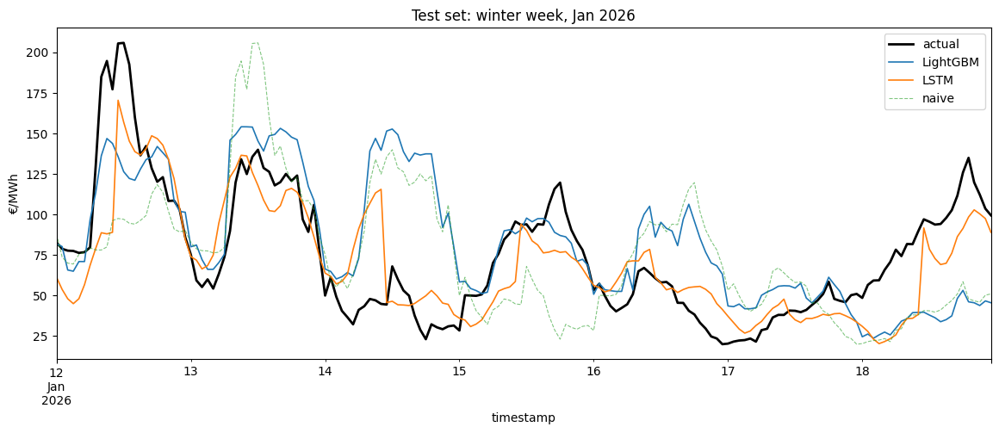
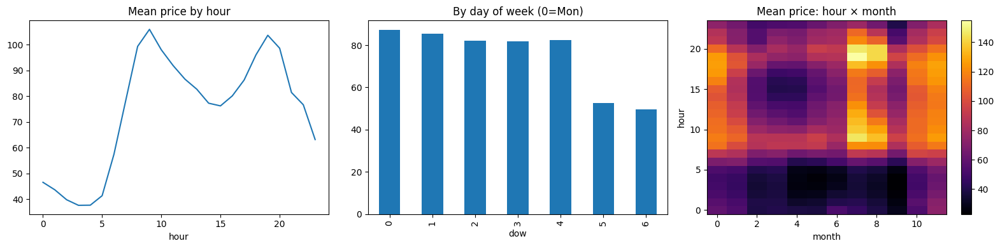
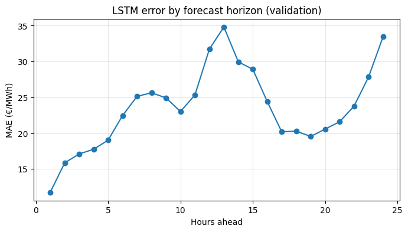
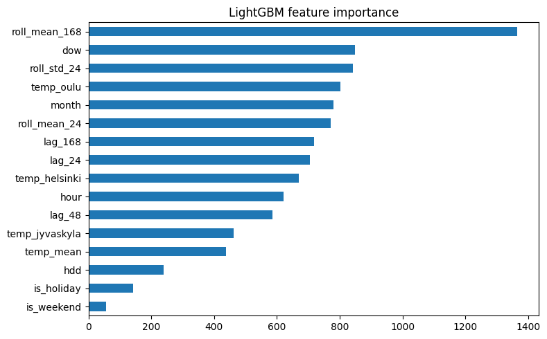

# Forecasting Finnish Day-Ahead Electricity Prices

A machine learning project: predict the next 24 hours of Nord Pool
spot prices for Finland (FI bidding zone), comparing an LSTM against a
LightGBM baseline and naive forecasts. Built entirely on open data with
**no API keys or signups required**.

<!-- FIGURE 1 (hero image): the test-set winter week plot from Step 7d,
     with actual price, LightGBM, LSTM and naive overlaid.
     -->


## Why this problem

Spot-price exposure is a daily operational reality in Finland for
electricity retailers, for industry running price-sensitive processes, and
for the growing share of consumers on exchange-priced (pörssisähkö)
contracts. A better 24-hour price forecast directly supports load shifting,
bidding, and pricing decisions. The stakes are real: during the January
2024 cold snap, Finnish spot prices briefly exceeded 2 €/kWh.

## Data

All sources are fully open:

| Source | What | Details |
|---|---|---|
| [Elering open API](https://dashboard.elering.ee/api/nps/price) | Nord Pool FI day-ahead prices | 2022-01 → 2026-06, resampled to hourly (market moved to 15-min resolution in late 2025) |
| [FMI open data](https://en.ilmatieteenlaitos.fi/open-data) | Hourly air temperature | 3 stations (Helsinki, Jyväskylä, Oulu) → national mean + heating-degree feature |

≈ 38,600 hourly observations spanning two distinct market regimes: the
2022 energy crisis (prices from −500 to +1,896 €/MWh) and the calmer but
still volatile 2023–2026 period.

Data quality notes: the Oulu station had a ~94-day gap, imputed from
Jyväskylä shifted by their mean offset (−0.7 °C). Price series had zero
missing hours.

<!-- FIGURE 2: the hour-of-day × month price heatmap from the EDA (Step 3).
      -->


## Method

- **Features**: calendar (local hour, weekday, month, Finnish public
  holidays), price lags (24 h, 48 h, 168 h), rolling statistics shifted to
  use only information available at forecast time, temperature and
  heating-degree hours.
- **Split**: strictly chronological. Train 2022–2024, validate on 2025,
  final test on Jan–Jun 2026. The test set was evaluated exactly once.
- **Models**:
  - Naive baselines: yesterday's price; last week's price
  - LightGBM on engineered tabular features (early stopping on validation)
  - LSTM: 168 hours of (price, temperature, calendar) in → 24 hourly
    prices out; 2 layers × 128 hidden units, L1 loss, early stopping

## Results

Test set: January–June 2026, never touched during development.

| Model | MAE (€/MWh) | RMSE (€/MWh) |
|---|---|---|
| Naive (yesterday) | 35.16 | 52.77 |
| Seasonal naive (−7 d) | 48.47 | 65.56 |
| LightGBM | 31.50 | 45.33 |
| **LSTM (168 h → 24 h)** | **25.41** | **40.18** |

<!-- FIGURE 3: the per-horizon MAE curve from Step 7a.
      -->


## Key findings

1. **The LSTM beats LightGBM by ~19% MAE, and the win is genuine.** The
   LSTM's input window ends 1 hour before the forecast period, giving it
   fresher information than LightGBM (whose price features are all lagged
   ≥ 24 h). But even at horizons 13–24 hours, where this freshness
   advantage has decayed, the LSTM's MAE (25.45) still beats LightGBM's
   overall 31.50. The architecture is learning price dynamics, not just
   exploiting recency.
2. **It generalized.** Validation MAE 23.6 → test MAE 25.4 on a completely
   unseen half-year that included a real Finnish winter.
3. **Crisis data helps.** Retraining LightGBM without the anomalous 2022
   energy-crisis year *worsened* test MAE from 31.50 to 34.16. Volatile-era
   data appears to teach transferable spike dynamics, even though its
   absolute price levels are obsolete.
4. **Naive baselines are hard to beat.** Strong autocorrelation at lags
   24 h (0.68) and 168 h (0.54) means yesterday's price alone gets you
   surprisingly far. Any model that can't beat it isn't worth deploying.

<!-- FIGURE 4: LightGBM feature importance bar chart.
      -->


## How to run

Open `spot_price_forecasting.ipynb` in Google Colab (GPU runtime
recommended for the LSTM: trains in ~2 minutes on a T4, much slower on
CPU). The notebook fetches all data from open APIs on first run and caches
it locally as parquet; subsequent runs load from cache.

```
pip install -r requirements.txt
```

## Honest limitations

- **Actual vs forecast weather**: the models use observed temperatures
  where a production system would use weather *forecasts*, making results
  slightly optimistic.
- **No wind generation data**: Fingrid's API (wind production and
  consumption forecasts) requires a free API key, which this no-signup
  project excluded. Likely the single most valuable missing feature as
  wind is the main driver of negative price hours.
- **Information asymmetry between models**: quantified above, but a
  production-faithful framing would forecast from the ~12:00 day-ahead
  bidding deadline (i.e., horizons of 12–36 hours).
- **Single seed, no hyperparameter search**: results are one training run
  each; a proper comparison would average over seeds.
- The Oulu temperature gap was imputed from a correlated station: a
  pragmatic, documented choice rather than a rigorous one.

## Next steps

- Probabilistic forecasts (quantile regression / pinball loss): a
  retailer cares about price *risk*, not just point estimates
- Add Fingrid wind and consumption forecasts
- Reframe to the true bidding-time horizon (12–36 h ahead)
- Try N-BEATS / Temporal Fusion Transformer for comparison

---
